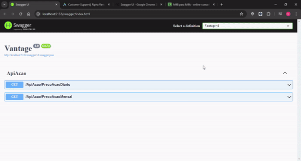

## 💻 Sobre o projeto

Bem-vindo à API de Dados de Ações, sua fonte confiável para informações sobre o desempenho diário e mensal das ações. Explore um vasto tesouro de dados financeiros e acompanhe o pulso do mercado com detalhes precisos sobre os valores de abertura, alta, baixa e fechamento das ações.

## 🛠 Tecnologias

As seguintes ferramentas foram usadas na construção do projeto:

- C#
- WebApi
- Swagger
- HttpClient 

## 🚀 Instalação e execução

1. Faça um clone desse repositório;
2. Certifique-se que tenha istaldo o Runtime Do .Net para rodar a aplicação.
3. Entre na pasta e rode o comando no terminal `dotnet watch run`;

## 🤔 Como contribuir para o projeto

1. Faça um *fork* do projeto.
2. Crie uma nova branch com as suas alterações: `git checkout -b my-feature`
3. Salve as alterações e crie uma mensagem de commit contando o que você fez: `git commit -m "feature: My new feature"`
4. Envie as suas alterações: `git push origin my-feature`
   > Caso tenha alguma dúvida confira este [guia de como contribuir no GitHub](https://github.com/firstcontributions/first-contributions)

Feito com Dedicação por Davi Lima 👋🏽 [Entre em contato!](https://www.linkedin.com/in/davi-lima-434605303/)
